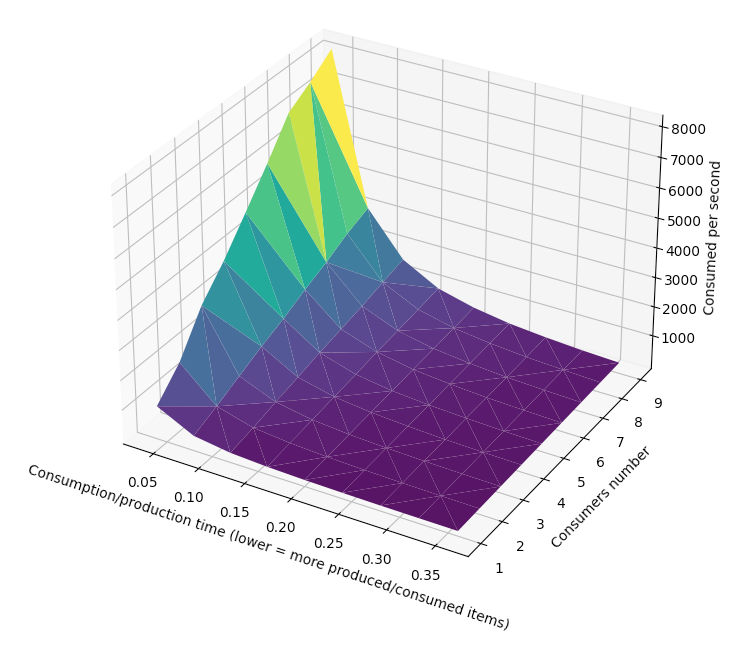

# ppds
## Third assignment focused on producer-consumer
### 🐍 Runs on Python 3.8.0 🐍

#### Producer-consumer

We chose to implement producer-consumer problem from lecture
Our solution is in main.py file

In our solution we used Lightswitch with Semaphore for locking critical parts in our application.
The critical parts are producing and consuming items. We represent production and consumption
of items by sleep() function and after production/consumption being done, we increment
produced_items_count/consumed_items_count. In producer() function we call signal() function
on items Semaphore, which signals consumers that there is item ready for consumption.
In consumer() function we call signal() function on free Semaphore which signals to produce items.
By using semaphores and LS we make sure that there can't be consumed more items that have been produced.
In plot_graph() function we plot results as 3d graph. x-axis represents consumption/production time.
This means time for which sleep() si called with. Lower the time, more items are produced/consumed.
Y-axis represents number of consumers and z-axis represents number of items consumed per second.
This function was heavily inspired by last year assignment shown at https://www.youtube.com/watch?v=vI_DA3WiijI&t.
In the main() function we cycle 100 times, in each cycle we count sleep_time based in index in iteration.
Also, we create different number of consumers from 1 to 10. Number of producers is set to 10 all the time.
After finishing all iteration we plot the result.
We can see result graph bellow:

